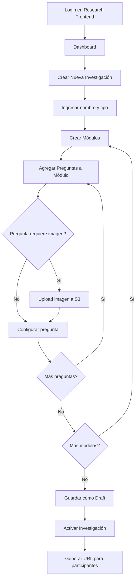
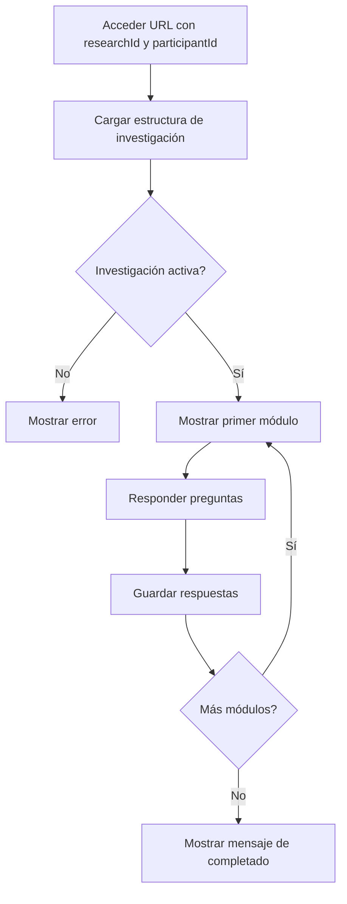
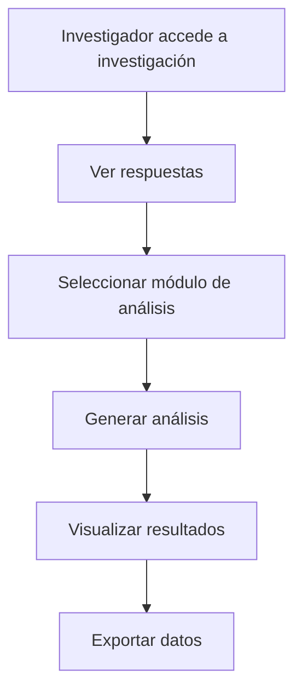

# EmotioxV3 - Arquitectura y Plan de Implementación

## 📋 Resumen Ejecutivo

EmotioxV3 es una plataforma de investigación que permite a investigadores crear estudios dinámicos con formularios personalizados y recopilar respuestas de participantes externos sin necesidad de registro previo.

### Componentes Principales:
- **Research Frontend**: Panel para investigadores (autenticado)
- **Participant Frontend**: Interfaz para participantes (sin autenticación)
- **Backend**: API serverless en AWS Lambda
- **Base de Datos**: PostgreSQL en RDS
- **Storage**: AWS S3 para imágenes

---

## 🏗️ Arquitectura del Sistema

### Stack Tecnológico

#### Frontend
- **Framework**: React 19 + Vite + TypeScript
- **Routing**: React Router Dom v7
- **State Management**: Zustand
- **Data Fetching**: TanStack Query (React Query)
- **Tables**: TanStack React Table
- **HTTP Client**: Axios
- **Styling**: Tailwind CSS v3
- **Date Handling**: date-fns

#### Backend
- **Runtime**: Node.js 20
- **Language**: TypeScript
- **Framework**: Serverless Framework v3
- **Platform**: AWS Lambda
- **API**: API Gateway (REST)

#### Infrastructure (AWS)
- **Compute**: Lambda (Serverless)
- **Database**: RDS PostgreSQL
- **Storage**: S3 (imágenes)
- **Authentication**: Cognito (research-frontend)
- **API**: API Gateway

---

## 🗄️ Esquema de Base de Datos (Dinámico con JSON Schema)

> **Filosofía**: Máxima flexibilidad con JSONB. El backend orquesta, no impone estructura rígida.

### Tablas Principales

#### 1. users
```sql
CREATE TABLE users (
  id UUID PRIMARY KEY DEFAULT gen_random_uuid(),
  email VARCHAR(255) UNIQUE NOT NULL,
  cognito_sub VARCHAR(255) UNIQUE NOT NULL,
  role VARCHAR(50) NOT NULL CHECK (role IN ('admin', 'researcher')),
  first_name VARCHAR(100),
  last_name VARCHAR(100),
  metadata JSONB DEFAULT '{}',  -- Datos adicionales dinámicos
  created_at TIMESTAMP DEFAULT CURRENT_TIMESTAMP,
  updated_at TIMESTAMP DEFAULT CURRENT_TIMESTAMP,
  deleted_at TIMESTAMP NULL
);

CREATE INDEX idx_users_email ON users(email);
CREATE INDEX idx_users_cognito_sub ON users(cognito_sub);
CREATE INDEX idx_users_role ON users(role);
```

#### 2. research_types (Templates de Admin)
```sql
CREATE TABLE research_types (
  id UUID PRIMARY KEY DEFAULT gen_random_uuid(),
  name VARCHAR(100) UNIQUE NOT NULL,
  description TEXT,
  default_modules JSONB DEFAULT '[]',  -- Array de módulos sugeridos
  settings JSONB DEFAULT '{}',         -- Configuraciones del tipo
  created_by UUID REFERENCES users(id),
  is_active BOOLEAN DEFAULT true,
  created_at TIMESTAMP DEFAULT CURRENT_TIMESTAMP,
  updated_at TIMESTAMP DEFAULT CURRENT_TIMESTAMP
);

CREATE INDEX idx_research_types_name ON research_types(name);
CREATE INDEX idx_research_types_active ON research_types(is_active);

-- Ejemplo de default_modules JSONB:
-- [
--   {
--     "name": "Datos Demográficos",
--     "description": "Información básica del participante",
--     "order": 1,
--     "is_default": true,
--     "questions": [
--       {
--         "type": "range",
--         "text": "¿Cuál es tu edad?",
--         "config": { "min": 18, "max": 100 },
--         "required": true
--       }
--     ]
--   }
-- ]
```

#### 3. researches
```sql
CREATE TABLE researches (
  id UUID PRIMARY KEY DEFAULT gen_random_uuid(),
  user_id UUID NOT NULL REFERENCES users(id) ON DELETE CASCADE,
  research_type_id UUID REFERENCES research_types(id) ON DELETE SET NULL,
  name VARCHAR(255) NOT NULL,
  description TEXT,
  status VARCHAR(50) NOT NULL DEFAULT 'draft' 
    CHECK (status IN ('draft', 'active', 'closed', 'completed', 'deleted')),
  settings JSONB DEFAULT '{}',         -- Configuraciones específicas
  metadata JSONB DEFAULT '{}',         -- Datos adicionales dinámicos
  created_at TIMESTAMP DEFAULT CURRENT_TIMESTAMP,
  updated_at TIMESTAMP DEFAULT CURRENT_TIMESTAMP,
  deleted_at TIMESTAMP NULL
);

CREATE INDEX idx_researches_user_id ON researches(user_id);
CREATE INDEX idx_researches_type_id ON researches(research_type_id);
CREATE INDEX idx_researches_status ON researches(status);
```

#### 4. modules
```sql
CREATE TABLE modules (
  id UUID PRIMARY KEY DEFAULT gen_random_uuid(),
  research_id UUID NOT NULL REFERENCES researches(id) ON DELETE CASCADE,
  name VARCHAR(255) NOT NULL,
  description TEXT,
  order_index INTEGER NOT NULL,
  is_from_template BOOLEAN DEFAULT false,  -- Si fue clonado de template
  config JSONB DEFAULT '{}',                -- Configuración dinámica del módulo
  created_at TIMESTAMP DEFAULT CURRENT_TIMESTAMP,
  updated_at TIMESTAMP DEFAULT CURRENT_TIMESTAMP
);

CREATE INDEX idx_modules_research_id ON modules(research_id);
CREATE INDEX idx_modules_order ON modules(research_id, order_index);
```

#### 5. questions
```sql
CREATE TABLE questions (
  id UUID PRIMARY KEY DEFAULT gen_random_uuid(),
  module_id UUID NOT NULL REFERENCES modules(id) ON DELETE CASCADE,
  question_type VARCHAR(50) NOT NULL,  -- Sin CHECK constraint para máxima flexibilidad
  question_text TEXT NOT NULL,
  order_index INTEGER NOT NULL,
  config JSONB NOT NULL DEFAULT '{}',  -- Toda la configuración es dinámica
  validation JSONB DEFAULT '{}',       -- Reglas de validación dinámicas
  required BOOLEAN DEFAULT false,
  created_at TIMESTAMP DEFAULT CURRENT_TIMESTAMP,
  updated_at TIMESTAMP DEFAULT CURRENT_TIMESTAMP
);

CREATE INDEX idx_questions_module_id ON questions(module_id);
CREATE INDEX idx_questions_order ON questions(module_id, order_index);
CREATE INDEX idx_questions_type ON questions(question_type);

-- Ejemplos de config JSONB por tipo (completamente flexible):
-- text: { "placeholder": "...", "maxLength": 500, "pattern": "regex" }
-- textarea: { "placeholder": "...", "rows": 5, "maxLength": 2000 }
-- range: { "min": 1, "max": 10, "step": 1, "labels": {...}, "showValue": true }
-- image_hitzone: { "imageUrl": "...", "zones": [...], "allowMultiple": false }
-- image_preference: { "images": [...], "selectionType": "single|multiple|rank" }
-- custom_type: { ...cualquier configuración... }
```

#### 6. media
```sql
CREATE TABLE media (
  id UUID PRIMARY KEY DEFAULT gen_random_uuid(),
  research_id UUID NOT NULL REFERENCES researches(id) ON DELETE CASCADE,
  question_id UUID REFERENCES questions(id) ON DELETE SET NULL,
  s3_key VARCHAR(500) NOT NULL,
  s3_bucket VARCHAR(255) NOT NULL,
  file_name VARCHAR(255) NOT NULL,
  file_type VARCHAR(100),
  file_size INTEGER,
  metadata JSONB DEFAULT '{}',  -- Metadatos adicionales (dimensiones, etc.)
  created_at TIMESTAMP DEFAULT CURRENT_TIMESTAMP
);

CREATE INDEX idx_media_research_id ON media(research_id);
CREATE INDEX idx_media_question_id ON media(question_id);
```

#### 7. responses
```sql
CREATE TABLE responses (
  id UUID PRIMARY KEY DEFAULT gen_random_uuid(),
  research_id UUID NOT NULL REFERENCES researches(id) ON DELETE CASCADE,
  participant_id VARCHAR(255) NOT NULL,  -- ID externo, sin validación
  module_id UUID NOT NULL REFERENCES modules(id) ON DELETE CASCADE,
  question_id UUID NOT NULL REFERENCES questions(id) ON DELETE CASCADE,
  answer JSONB NOT NULL,                 -- Respuesta completamente dinámica
  metadata JSONB DEFAULT '{}',           -- Timestamp, IP, device, etc.
  created_at TIMESTAMP DEFAULT CURRENT_TIMESTAMP
);

CREATE INDEX idx_responses_research_id ON responses(research_id);
CREATE INDEX idx_responses_participant_id ON responses(participant_id);
CREATE INDEX idx_responses_research_participant ON responses(research_id, participant_id);
CREATE INDEX idx_responses_question_id ON responses(question_id);
CREATE INDEX idx_responses_created_at ON responses(created_at);

-- Ejemplos de answer JSONB (sin restricciones):
-- text/textarea: { "value": "..." }
-- range: { "value": 7 }
-- image_hitzone: { "clicks": [{ "x": 150, "y": 200, "timestamp": 1234567890 }] }
-- image_preference: { "selected": ["img1"], "ranking": [2, 1, 3], "timeSpent": 45 }
```

#### 8. analysis_modules
```sql
CREATE TABLE analysis_modules (
  id UUID PRIMARY KEY DEFAULT gen_random_uuid(),
  name VARCHAR(255) NOT NULL,
  description TEXT,
  module_type VARCHAR(100) NOT NULL,
  config JSONB DEFAULT '{}',           -- Configuración del módulo de análisis
  is_active BOOLEAN DEFAULT true,
  created_at TIMESTAMP DEFAULT CURRENT_TIMESTAMP,
  updated_at TIMESTAMP DEFAULT CURRENT_TIMESTAMP
);

CREATE INDEX idx_analysis_modules_type ON analysis_modules(module_type);
CREATE INDEX idx_analysis_modules_active ON analysis_modules(is_active);
```

---

## 🔌 API Endpoints

### Arquitectura de API
- **Patrón**: Single Lambda con routing interno
- **Endpoint único**: `https://api.emotioxv3.com/{proxy+}`
- **Routing**: Basado en path y método HTTP

### Endpoints por Módulo

#### Auth Module (`/auth`)
```
POST   /auth/register          - Registro de investigador
POST   /auth/login             - Login (retorna tokens de Cognito)
POST   /auth/logout            - Logout
POST   /auth/refresh           - Refresh token
DELETE /auth/account           - Eliminar cuenta (soft delete)
GET    /auth/me                - Obtener usuario actual
```

#### Research Types Module (`/research-types`) - Solo Admin
```
GET    /research-types                    - Listar tipos de investigación
POST   /research-types                    - Crear tipo de investigación
GET    /research-types/:id                - Obtener tipo por ID
PUT    /research-types/:id                - Actualizar tipo
DELETE /research-types/:id                - Eliminar tipo
PATCH  /research-types/:id/modules        - Actualizar módulos sugeridos (default_modules)
```

#### Research Module (`/research`)
```
GET    /research                          - Listar investigaciones del usuario
POST   /research                          - Crear investigación (con opción de usar templates)
GET    /research/:id                      - Obtener investigación por ID
PUT    /research/:id                      - Actualizar investigación
DELETE /research/:id                      - Eliminar investigación (soft delete)
PATCH  /research/:id/status               - Cambiar estado (draft→active→closed→completed)
POST   /research/:id/clone-template       - Clonar módulos de template a investigación
```

#### Modules Module (`/modules`)
```
GET    /research/:researchId/modules              - Listar módulos de investigación
POST   /research/:researchId/modules              - Crear módulo
GET    /modules/:id                               - Obtener módulo
PUT    /modules/:id                               - Actualizar módulo
DELETE /modules/:id                               - Eliminar módulo
PATCH  /modules/:id/reorder                       - Reordenar módulos
```

#### Questions Module (`/questions`)
```
GET    /modules/:moduleId/questions               - Listar preguntas de módulo
POST   /modules/:moduleId/questions               - Crear pregunta
GET    /questions/:id                             - Obtener pregunta
PUT    /questions/:id                             - Actualizar pregunta
DELETE /questions/:id                             - Eliminar pregunta
PATCH  /questions/:id/reorder                     - Reordenar preguntas
```

#### Media Module (`/media`)
```
POST   /media/upload-url                          - Generar presigned URL para upload
POST   /media                                     - Registrar media en DB
GET    /media/:id                                 - Obtener info de media
GET    /media/:id/url                             - Generar presigned URL para download
DELETE /media/:id                                 - Eliminar media
```

#### Responses Module (`/responses`)
```
POST   /responses                                 - Guardar respuesta de participante
GET    /research/:researchId/responses            - Obtener todas las respuestas
GET    /research/:researchId/participant/:participantId/responses - Respuestas de un participante
GET    /responses/export/:researchId              - Exportar respuestas (CSV/JSON)
```

#### Public Module (`/public`) - Sin autenticación
```
GET    /public/research/:researchId               - Obtener estructura de investigación para participante
POST   /public/responses                          - Guardar respuesta (sin auth)
```

#### Analysis Module (`/analysis`)
```
GET    /analysis/modules                          - Listar módulos de análisis disponibles
GET    /analysis/research/:researchId             - Obtener análisis de investigación
POST   /analysis/research/:researchId/generate    - Generar análisis
```

---

## 🔐 Autenticación y Autorización

### Research Frontend
- **Método**: AWS Cognito User Pools
- **Flujo**: Hosted UI o SDK de Amplify
- **Tokens**: JWT (ID Token, Access Token, Refresh Token)
- **Roles**: Admin, Researcher

### Participant Frontend
- **Método**: Sin autenticación
- **Acceso**: URL con parámetros `researchId` y `participantId`
- **Validación**: Solo verificar que research existe y está en estado `active`

### Middleware de Autorización (Backend)
```typescript
// Verificar token de Cognito
const authMiddleware = async (event) => {
  const token = event.headers.Authorization?.replace('Bearer ', '');
  const decoded = await verifyJWT(token);
  return decoded;
};

// Verificar permisos
const checkPermission = (user, resource, action) => {
  // Admin: acceso total
  // Researcher: solo sus propios recursos
};
```

---

## 🎨 Tipos de Preguntas - Especificaciones

### 1. Text
```typescript
interface TextQuestion {
  type: 'text';
  config: {
    placeholder?: string;
    maxLength?: number;
    pattern?: string; // regex
  };
}
```

### 2. Textarea
```typescript
interface TextareaQuestion {
  type: 'textarea';
  config: {
    placeholder?: string;
    rows?: number;
    maxLength?: number;
  };
}
```

### 3. Range Selector
```typescript
interface RangeQuestion {
  type: 'range';
  config: {
    min: number;
    max: number;
    step: number;
    labels?: {
      min?: string;
      max?: string;
      [key: number]: string; // labels intermedios
    };
    showValue?: boolean;
  };
}
```

### 4. Image Hitzone
```typescript
interface ImageHitzoneQuestion {
  type: 'image_hitzone';
  config: {
    imageUrl: string; // S3 presigned URL
    zones?: Array<{
      id: string;
      name: string;
      coordinates: { x: number; y: number; width: number; height: number };
    }>;
    allowMultiple?: boolean;
  };
}

interface ImageHitzoneAnswer {
  clicks: Array<{
    x: number;
    y: number;
    zone?: string; // si cae en una zona definida
    timestamp: number;
  }>;
}
```

### 5. Image Preference
```typescript
interface ImagePreferenceQuestion {
  type: 'image_preference';
  config: {
    images: Array<{
      id: string;
      url: string; // S3 presigned URL
      label?: string;
    }>;
    selectionType: 'single' | 'multiple' | 'rank';
    minSelections?: number;
    maxSelections?: number;
  };
}

interface ImagePreferenceAnswer {
  selected: string[]; // IDs de imágenes
  ranking?: number[]; // orden de preferencia si type='rank'
}
```

---

## 🔄 Flujos de Usuario

### Flujo 1: Investigador crea investigación



### Flujo 2: Participante responde investigación



### Flujo 3: Análisis de resultados



---

## 📦 Estructura de Módulos del Backend

```
backend/
├── src/
│   ├── handler.ts                    # Entry point (router principal)
│   ├── config/
│   │   ├── database.ts               # Configuración de PostgreSQL
│   │   ├── cognito.ts                # Configuración de Cognito
│   │   └── s3.ts                     # Configuración de S3
│   ├── middleware/
│   │   ├── auth.ts                   # Middleware de autenticación
│   │   ├── errorHandler.ts          # Manejo de errores
│   │   └── validator.ts              # Validación de requests
│   ├── modules/
│   │   ├── auth/
│   │   │   ├── auth.controller.ts
│   │   │   ├── auth.service.ts
│   │   │   └── auth.types.ts
│   │   ├── research-types/
│   │   │   ├── research-types.controller.ts
│   │   │   ├── research-types.service.ts
│   │   │   └── research-types.types.ts
│   │   ├── research/
│   │   │   ├── research.controller.ts
│   │   │   ├── research.service.ts
│   │   │   └── research.types.ts
│   │   ├── modules/
│   │   │   ├── modules.controller.ts
│   │   │   ├── modules.service.ts
│   │   │   └── modules.types.ts
│   │   ├── questions/
│   │   │   ├── questions.controller.ts
│   │   │   ├── questions.service.ts
│   │   │   └── questions.types.ts
│   │   ├── media/
│   │   │   ├── media.controller.ts
│   │   │   ├── media.service.ts
│   │   │   └── media.types.ts
│   │   ├── responses/
│   │   │   ├── responses.controller.ts
│   │   │   ├── responses.service.ts
│   │   │   └── responses.types.ts
│   │   ├── public/
│   │   │   ├── public.controller.ts
│   │   │   └── public.service.ts
│   │   └── analysis/
│   │       ├── analysis.controller.ts
│   │       ├── analysis.service.ts
│   │       └── analysis.types.ts
│   ├── utils/
│   │   ├── response.ts               # Helpers para responses HTTP
│   │   ├── jwt.ts                    # Helpers para JWT
│   │   └── validators.ts             # Validadores comunes
│   └── types/
│       └── index.ts                  # Tipos globales
├── serverless.yml
├── tsconfig.json
└── package.json
```

---

## 🚀 Plan de Implementación por Fases

### Fase 1: Infraestructura Base (Semana 1)
- [ ] Configurar RDS PostgreSQL
- [ ] Crear tablas de base de datos
- [ ] Configurar S3 bucket para imágenes
- [ ] Configurar Cognito User Pool
- [ ] Setup básico del backend (handler + routing)
- [ ] Configurar variables de entorno

### Fase 2: Autenticación (Semana 1-2)
- [ ] Implementar módulo de auth en backend
- [ ] Integrar Cognito en research-frontend
- [ ] Crear páginas de login/registro
- [ ] Implementar middleware de autenticación
- [ ] Manejo de tokens y refresh

### Fase 3: CRUD de Investigaciones (Semana 2-3)
- [ ] Backend: Módulo de research
- [ ] Backend: Módulo de modules
- [ ] Backend: Módulo de questions
- [ ] Frontend: Dashboard de investigaciones
- [ ] Frontend: Formulario de creación de investigación
- [ ] Frontend: Constructor de módulos y preguntas

### Fase 4: Gestión de Media (Semana 3)
- [ ] Backend: Módulo de media
- [ ] Backend: Presigned URLs para S3
- [ ] Frontend: Upload de imágenes
- [ ] Frontend: Galería de imágenes

### Fase 5: Participant Frontend (Semana 4)
- [ ] Backend: Módulo public
- [ ] Frontend: Renderizado dinámico de formularios
- [ ] Frontend: Componentes para cada tipo de pregunta
- [ ] Frontend: Envío de respuestas
- [ ] Validación de URL params

### Fase 6: Respuestas y Análisis (Semana 5)
- [ ] Backend: Módulo de responses
- [ ] Backend: Módulo de analysis
- [ ] Frontend: Visualización de respuestas
- [ ] Frontend: Módulos de análisis predefinidos
- [ ] Exportación de datos

### Fase 7: Testing y Optimización (Semana 6)
- [ ] Tests unitarios backend
- [ ] Tests de integración
- [ ] Tests E2E frontend
- [ ] Optimización de queries
- [ ] Performance testing

### Fase 8: Deployment (Semana 7)
- [ ] CI/CD pipeline
- [ ] Deploy a staging
- [ ] Testing en staging
- [ ] Deploy a producción
- [ ] Monitoreo y logs

---

## 🔧 Variables de Entorno

### Backend
```env
# Database
DB_HOST=
DB_PORT=5432
DB_NAME=emotioxv3
DB_USER=
DB_PASSWORD=

# AWS
AWS_REGION=us-east-1
S3_BUCKET_NAME=emotioxv3-media
COGNITO_USER_POOL_ID=
COGNITO_CLIENT_ID=

# API
API_STAGE=dev
CORS_ORIGIN=http://localhost:5173,http://localhost:5174
```

### Research Frontend
```env
VITE_API_URL=https://api.emotioxv3.com
VITE_COGNITO_USER_POOL_ID=
VITE_COGNITO_CLIENT_ID=
VITE_COGNITO_REGION=us-east-1
```

### Participant Frontend
```env
VITE_API_URL=https://api.emotioxv3.com
```

---

## 📊 Consideraciones de Escalabilidad

### Base de Datos
- Índices en columnas frecuentemente consultadas
- Particionamiento de tabla `responses` por `research_id` si crece mucho
- Connection pooling con RDS Proxy

### Lambda
- Memory: 512MB - 1024MB
- Timeout: 30s
- Concurrent executions: 100 (ajustable)
- Cold start optimization con Provisioned Concurrency si es necesario

### S3
- Lifecycle policies para archivar imágenes antiguas
- CloudFront CDN para servir imágenes (opcional)

### Costos Estimados (uso moderado)
- RDS PostgreSQL (db.t3.micro): ~$15/mes
- Lambda: ~$5/mes (1M requests)
- S3: ~$5/mes (50GB)
- Cognito: Gratis (hasta 50k MAU)
- **Total**: ~$25-30/mes

---

## 🎯 Próximos Pasos Inmediatos

1. **Revisar y aprobar** esta arquitectura
2. **Decidir** si empezamos con Fase 1 o ajustamos algo
3. **Configurar** recursos de AWS (RDS, S3, Cognito)
4. **Comenzar** implementación del backend

¿Apruebas esta arquitectura o hay algo que quieras ajustar?
